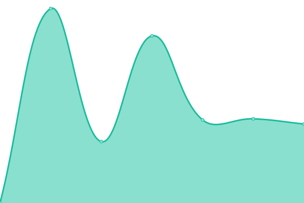
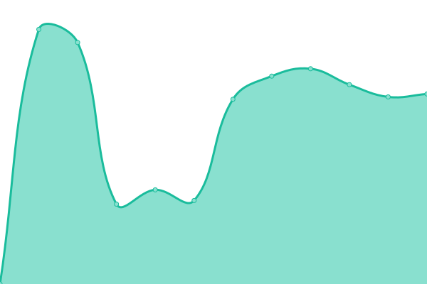

# [📈 Live Status](https://solbra.github.io/status): <!--live status--> **Todos os sistemas estão operacionais**

This repository contains the open-source uptime monitor and status page for [SOLBRA](https://www.solbra.com.br), powered by [Upptime](https://github.com/upptime/upptime).

With [Upptime](https://upptime.js.org), you can get your own unlimited and free uptime monitor and status page, powered entirely by a GitHub repository. We use [Issues](https://github.com/solbra/status/issues) as incident reports, [Actions](https://github.com/solbra/status/actions) as uptime monitors, and [Pages](https://solbra.github.io/status) for the status page.

<!--start: status pages-->
<!-- This summary is generated by Upptime (https://github.com/upptime/upptime) -->
<!-- Do not edit this manually, your changes will be overwritten -->
<!-- prettier-ignore -->
| URL | Status | History | Response Time | Uptime |
| --- | ------ | ------- | ------------- | ------ |
|  [Solbra](https://solbra.com.br) | Ativo | [solbra.yml](https://github.com/solbra/status/commits/HEAD/history/solbra.yml) | 

 1918ms
     
 | 

<a href="https://status.solbra.com.br/history/solbra">95.04%</a>
    

|  [Olha Meu Link](https://olhameu.link) | Ativo | [olha-meu-link.yml](https://github.com/solbra/status/commits/HEAD/history/olha-meu-link.yml) | 

 794ms
     
 | 

<a href="https://status.solbra.com.br/history/olha-meu-link">95.20%</a>
    

|  [ApoioGenealogi.co](https://apoiogenealogi.co) | Ativo | [apoio-genealogi-co.yml](https://github.com/solbra/status/commits/HEAD/history/apoio-genealogi-co.yml) | 

 2283ms
     
 | 

<a href="https://status.solbra.com.br/history/apoio-genealogi-co">95.21%</a>
    

<!--end: status pages-->

[**Visit our status website →**](https://solbra.github.io/status)

## 📄 License

- Powered by: [Upptime](https://github.com/upptime/upptime)
- Code: [MIT](./LICENSE) © [Anand Chowdhary](https://anandchowdhary.com), supported by [Pabio](https://pabio.com)
- Data in the `./history` directory: [Open Database License](https://opendatacommons.org/licenses/odbl/1-0/)
